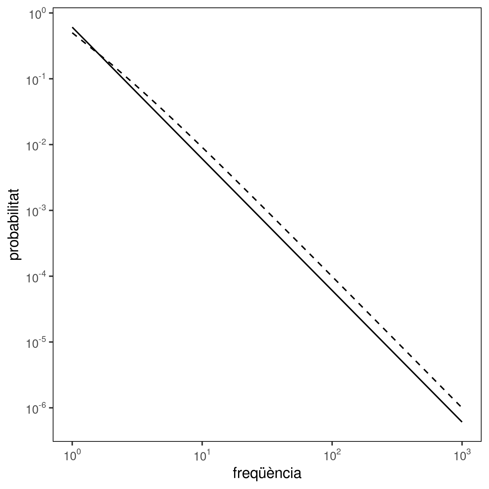

# Comparació de dos models de la probabilitat de la freqüència d'una paraula

Aquest script correspon a la figura 13 i genera la següent gràfica:



Aquesta gràfica s'ha generat executant el script:

```
Rscript compare_frequency_probability.R
```

El script necessita les llibreries `ggplot2` i `VGAM` per tal de funcionar.

