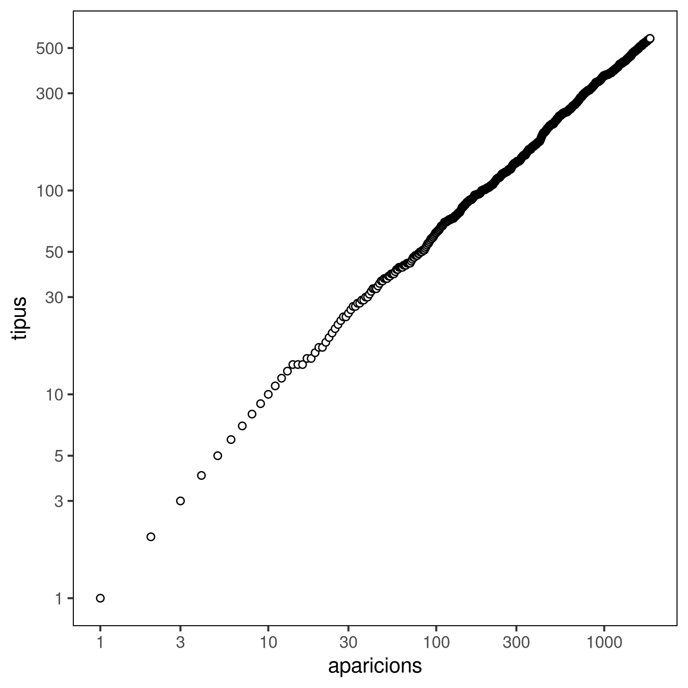

# Nombre de paraules distintes en funció del nombre de paraules totals

Aquest script mostra la relació entre el número de paraules diferents i el
número de paraules totals d'un text en escala log-log. Correspon a la figura 12
del llibre.

La gràfica la genera aquest script de `R`, executable amb `Rscript`. Depèn del
paquet `ggplot2`, que es pot instal·lar des de una línia de comandes de `R`:

``` r
install.packages('ggplot2')
```

L'anàlisi del text, però, l'executa un script de `python`. El resultat del
script de `python` és un csv què aquest script pren com a paràmetre. Tant un
fitxer csv d'exemple creat a partir del text de la declaració dels drets humans
com el script de `python` que el genera es poden trobar dins el subdirectori
d'[anàlisis de text](../text_analysis).

Utilitzant aquest fitxer d'exemple, es pot generar una gràfica semblant a la del llibre:



Aquesta gràfica s'ha generat a partir de la següent comanda:

```
Rscript distinct_total.R ../text_analysis/DeclaracioDretsHumansDistintes.csv distinct_total.png 
```

La imatge generada no té perquè ser `png`, per exemple `jpg` o `pdf` es poden
generar canviant la extensió del nom del fitxer de sortida.
