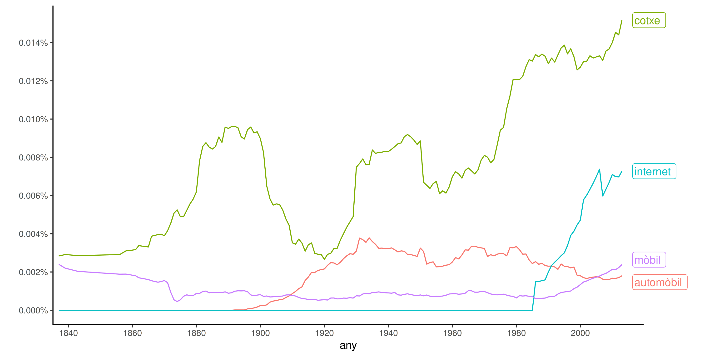
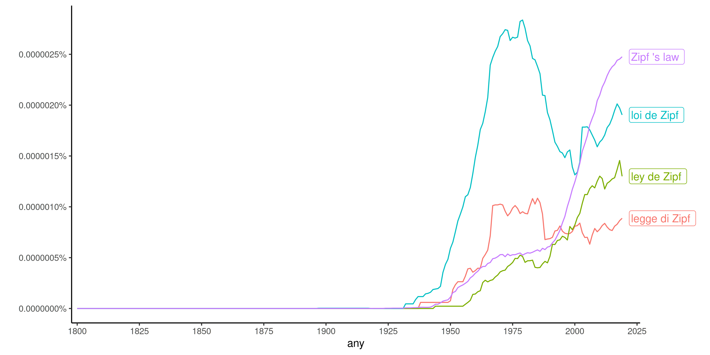

# Evolució de la freqüència de n-grames en el temps

Aquest script de `R` mostra la evolució en el temps d'un conjunt de
n-grames. Correspon a les figures 14 i 15 del llibre.

El script depèn dels paquets `ggplot2`, `dplyr`, `tidyr` i `ggrepel` que es pot
instal·lar des de una línia de comandes de `R`:

``` r
install.packages('ggplot2')
```

``` r
install.packages('dplyr')
```

``` r
install.packages(`tidyr`)
```

``` r
install.packages('ggrepel')
```

El script pren com a paràmetre un fitxer csv amb les dades sobre la evolució
dels n-grames amb el temps. El fitxer ha de contenir tres columnes per al any,
n-grama i proporció (`year`, `ngram` i `proportion`). Cada fila representa la
proporció (freqüència / total) del n-grama en aquell any. Si no hi ha dades per
un any concret, s'interpreta com a proporció zero.

En aquest directori s'inclouen les dades corresponents en format csv a les
figures del llibre, que s'han obtingut transformant les dades a partir dels
format oferts per [Google Ngrams](https://books.google.com/ngrams/)
([`zipf_ngrams.csv`](zipf_ngrams.csv)) i pel [CTILC](https://ctilc.iec.cat)
([`catalan_words.csv`](catalan_words.csv)). Cap dels dos serveis ofereix un
sistema oficial per obtenir les dades en un format informàtic. Més informació
sobre com obtenir dades d'aquests dos serveis en concret es pot trobar en els
scripts ([`clean_google.py`](clean_google.py) i
[`clean_ctilc.py`](clean_ctilc.py)).

Utilitzant aquests fitxers csv ja generats, es poden generar unes gràfiques
semblants a les del llibre:





Aquestes gràfiques s'han generat a partir de les següents comandes:

```
Rscript frequency_evolution.R catalan_words.csv ctilc_frequency_evolution.png
```

```
Rscript frequency_evolution.R zipf_ngrams.csv google_frequency_evolution.png
```

La imatge generada no té perquè ser `png`, per exemple `jpg` o `pdf` es poden
generar canviant la extensió del nom del fitxer de sortida.
