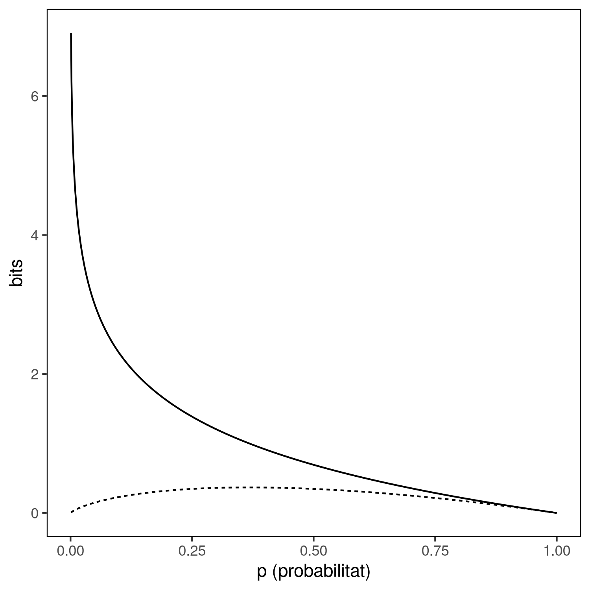

# Relació entre informació i probabilitat

Aquest script de `R` correspon a la figura 8 del llibre. Genera la següent
gràfica:



Aquesta gràfica s'ha generat executant el script:

```
Rscript information_probability.R
```

El script depèn de la llibreria `ggplot2`. Es podt instal·la des de qualsevol
línia de comandes de `R`:

``` r
install.packages('ggplot2')
```
