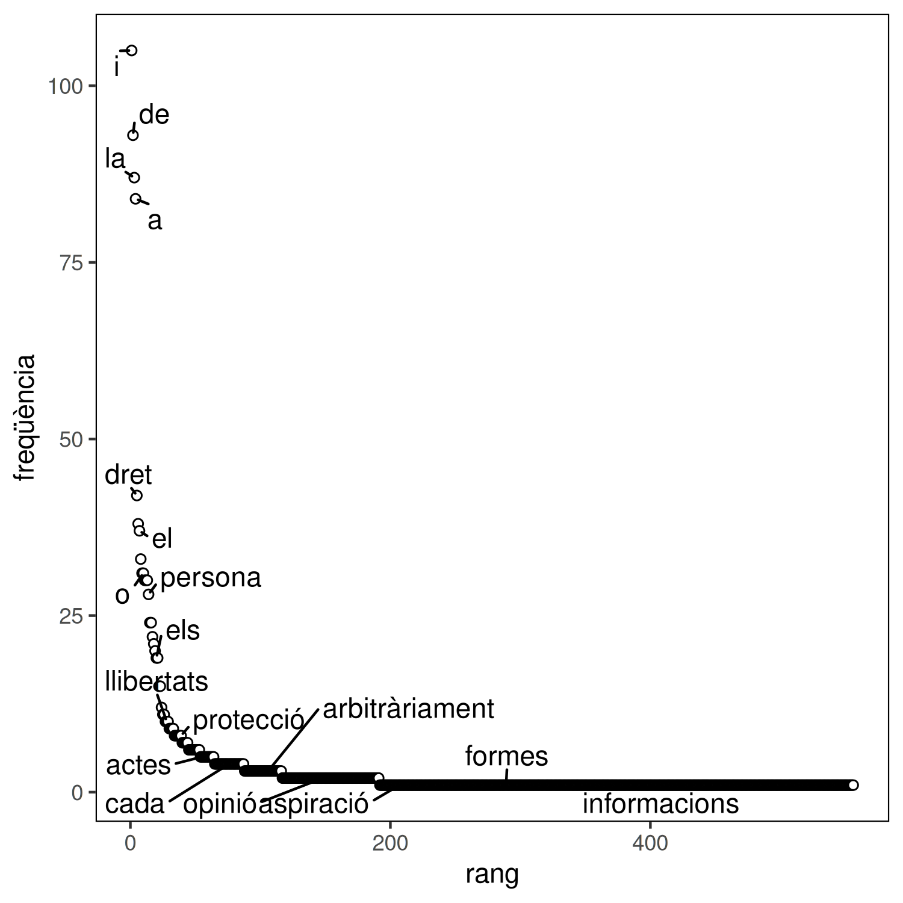

# Relació rang-freqüència

Aquest script de `R` mostra la relació entre freqüència i rang dels mots d'un
text, opcionalment en escala doble logarítmica. A més, també pot mostrar alguns
dels mots dins la gràfica. Correspon a les figures 3 i 4 del llibre.

El script depèn del paquet `ggplot2` i, opcionalment si es volen mostrar les
paraules, del paquet `ggrepel` que es poden instal·lar des de una línia de
comandes de `R`:

``` r
install.packages('ggplot2')
```

``` r
install.packages('ggrepel')
```

El script pren com a paràmetre una fitxer csv amb la freqüència de cadascuna de
les paraules d'un text. Aquest repositori inclou un [script](../text_analysis)
de `python` per a generar aquest fitxer a partir d'un text. El mateix directori
inclou el fitxer csv corresponent a la declaració dels drets humans en català.


Utilitzant aquest fitxer d'exemple, es pot generar gràfiques semblants a les
del llibre:




Aquestes gràfiques s'han generat a partir de les següents comandes respectivament:

```
Rscript rank_frequency.R ../text_analysis/DeclaracioDretsHumansFrequencies.csv rank_frequency.png --paraules
```

```
Rscript rank_frequency.R ../text_analysis/DeclaracioDretsHumansFrequencies.csv rank_frequency_loglog.png --paraules --loglog
```

La opció `--paraules` resulta en un error si el paquet `ggrepel` no està
instal·lat. La imatge generada no té perquè ser `png`, per exemple `jpg` o
`pdf` es poden generar canviant la extensió del nom del fitxer de sortida.
