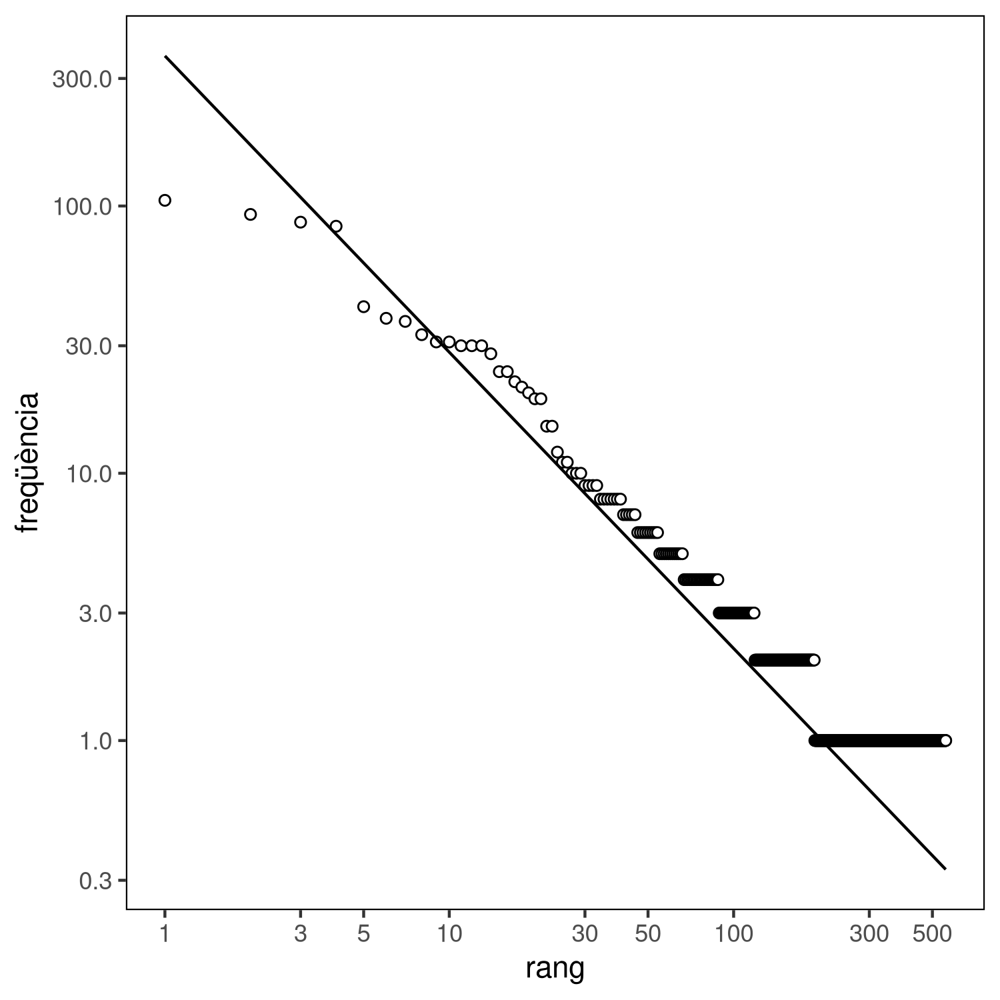

# Theil-Sen

L'estimador Theil-Sen és un mètode per fitar una línia a un conjunt de
punts. Utilitza la mediana dels pendents de totes les línies que passen per
parelles de punts. És un mètode robust per a fitar línies a conjunts de punts.

Recordem que la relació entre el rang d'una paraula i la seva freqüència dins
un text segueix la llei potencial

.

Per tal d'obtenir una equació lineal podem aplicar un logaritme als dos costats
de la igualtat:

.

Obtenim així una equació lineal

,

on

,

,

,

.

Aplicant el mètode Theil-Sen de regressió lineal al logaritme del rang  i de la freqüència , el pendent
obtingut  és equivalent a la constant 
mentre que la constant  es recupera amb .

El següent script pren com a paràmetre un fitxer csv generat a partir del text
amb la freqüència i rang de cada paraula (un script per generar-ne un a partir
de qualsevol text, així com un fitxer d'exemple generat a partir de la versió
catalana de la declaració dels drets human es troba al directori d'[anàlisis de
text](../text_analysis)) i, opcionalment, un fitxer on desar la gràfica que
mostra l'ajustament. El script mostra el valor estimat de l'exponent
 i de la constant .

Aquest script depén del paquet `deming` i, opcionalment per tal de generar la
gràfica, del paquet `ggplot2` Els paquets es poden instal·lar des de una línia
de comandes de `R`:

``` r
install.packages('deming')
```

``` r
install.packages(ggplot2')
```

Com a exemple, una gràfica generada amb aquest script:



Que s'ha generat amb la comanda

```
Rscript theil_sen.R ../text_analysis/DeclaracioDretsHumansFrequencies.csv theil_sen.png
```

La imatge generada no té perquè ser `png`, per exemple `jpg` o `pdf` es poden
generar canviant la extensió del nom del fitxer de sortida. També és possible
no generar cap imatge i simplement mostrar els paràmetres ometent el nom del
fitxer a on desar la imatge.
