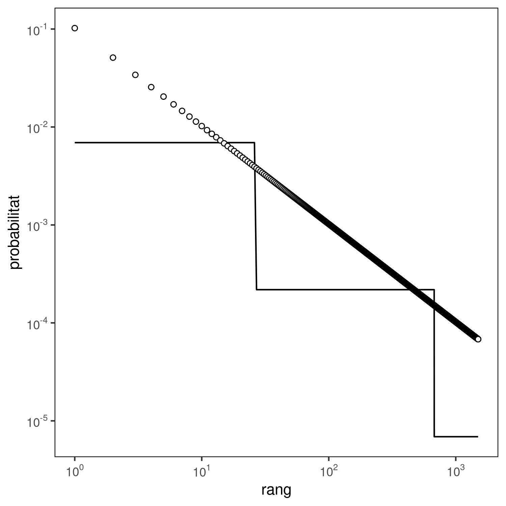

# Comparació entre la mecanografia aleatòria i la distribució Zeta truncada

Aquest script correspon a la figura 11 i genera la següent gràfica:



Aquesta gràfica s'ha generat executant el script:

```
Rscript typing_zeta.R
```

El script necessita les llibreries `ggplot2` i `purrr` per tal de funcionar.
