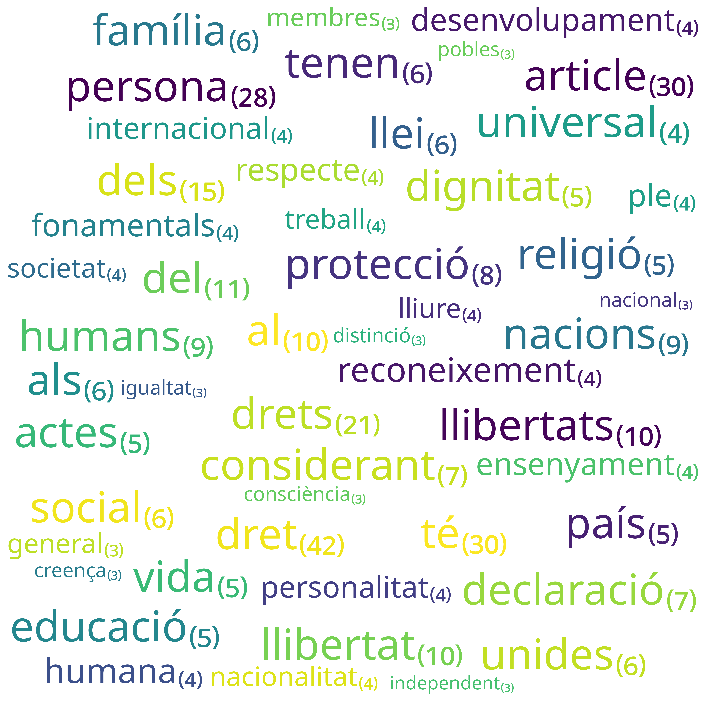

# Núvol de Paraules

Aquest script de `python` genera un núvol de les 50 paraules més freqüents en
un text. A més, pot mostrar la freqüència de cada paraula dins el
text. Correspon a la figura 2 del llibre.

El codi depèn del paquet `wordcloud` que fa la feina més complexa de
col·locar les paraules en forma de núvol. El paquet es pot instal·lar
utilitzant `pip`:

```
pip3 install wordcloud==1.8.1
```

El script pren com a paràmetre una fitxer csv amb la freqüència de cadascuna de
les paraules d'un text. Aquest repositori inclou un [script](../text_analysis)
de `python` per a generar aquest fitxer a partir d'un text. El mateix directori
inclou el fitxer csv corresponent a la declaració dels drets humans en català.

Utilitzant aquest fitxer d'exemple, es pot generar un núvol de paraules
semblant al del llibre:



Aquest núvol de paraules s'ha generat a partir de la següent comanda:

```
python3 word_cloud.py --mostra-frequencies ../text_analysis/DeclaracioDretsHumansFrequencies.csv word_cloud.png
```

Es poden controlar molts aspectes de la generació del núvol de paraules sense
entrar dins el codi. Vegeu el resultat d'executar:

```
python3 word_cloud.py --help
```

També pot ser d'utilitat veure la documentació del paquet `wordcloud`,
disponible en anglès a https://amueller.github.io/word_cloud, aquest paquet
permet moltes més opcions de les utilitzades per aquest script.
